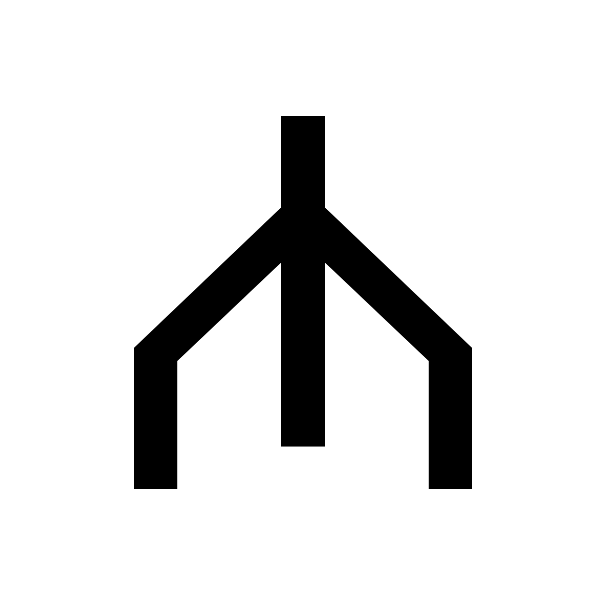

<p align="center">
  <a href="https://umbod.ai">
    
  </a>
</p>

<h1 align="center">Umbod</h1>

<p align="center"><strong>Manage agent access. On your own infrastructure.</strong></p>

<p align="center">
  <a href="https://umbod.ai">Website</a> ·
  <a href="https://umbod.ai/docs/">Documentation</a> ·
  <a href="https://discord.gg/mjrbtBYeS">Discord</a>
</p>

Connect your internal APIs and MCP servers to the agents your teams use. Umbod gives you one place to configure connectors, publish tools, and control access by group—all running on your own infrastructure.

- **Connect once.** Bring OpenAPI services and downstream MCP servers together, or build a custom connector.
- **Control access.** Decide which groups can use which tools through a shared administration interface.
- **Keep your choice of agent.** Keep connectors and access rules independent of your agent vendor.

## Get started

Try Umbod on a local Kubernetes cluster. You’ll need [Docker](https://docs.docker.com/get-docker/), [kind](https://kind.sigs.k8s.io/), [kubectl](https://kubernetes.io/docs/tasks/tools/), and [Helm 3](https://helm.sh/docs/intro/install/).

Create the cluster and install Umbod:

```bash
kind create cluster --name umbod --wait 2m

helm upgrade --install umbod \
  oci://ghcr.io/computerlovetech/charts/umbod \
  --version 0.0.1-beta.4 \
  --kube-context kind-umbod \
  --set config.profile=local \
  --set config.authentication.mode=dev \
  --set-string config.publicOrigins.site=http://localhost:3000 \
  --wait --timeout 5m

kubectl --context kind-umbod port-forward \
  service/umbod-frontend 3000:3000
```

Open **[localhost:3000](http://localhost:3000)**. Keep the port-forward running while you explore.

This local setup uses development authentication. For a shared cluster, follow the [installation guide](https://umbod.ai/docs/getting-started/kubernetes-installation/) to configure identity, ingress, and storage.

## Give your agents something to work with

1. **Add a connector.** Connect an internal API through its OpenAPI specification, or register an existing MCP server.
2. **Publish its tools.** Configure the connector and choose the tools to make available.
3. **Grant access.** Set group permissions, then connect a compatible MCP client.

Need a custom integration? **[Build a connector →](https://umbod.ai/docs/plugins/build-a-connector/)**

## Explore the docs

| | |
| --- | --- |
| [Installation](https://umbod.ai/docs/getting-started/kubernetes-installation/) | Install locally or configure a shared cluster. |
| [Architecture](https://umbod.ai/docs/operations/service-topology/) | Understand the services, data flow, and storage. |
| [Configuration](https://umbod.ai/docs/operations/configuration/) | Configure authentication, public origins, and persistence. |
| [Helm reference](https://umbod.ai/docs/reference/helm-values/) | Find chart settings and defaults. |
| [Endpoints and ports](https://umbod.ai/docs/reference/endpoints-and-ports/) | Connect clients and configure routing. |

## Project status

Umbod is in **early beta**. Connector administration, tool publication, group permissions, and Helm installation are available today. The current chart runs a single core replica backed by SQLite and is intended for development and evaluation.

Try it with an integration your team actually needs. [Report an issue](https://github.com/computerlovetech/umbod/issues) or [join the conversation on Discord](https://discord.gg/mjrbtBYeS).

## Contributing

See the [development guide](umbod/README.md) for local setup and checks.

- [`umbod/`](umbod/) — API, MCP server, admin interface, and Helm chart.
- [`packages/umbod-sdk/`](packages/umbod-sdk/) — Python SDK for connector authors.
- [`website/`](website/) — Landing page and documentation publishing.

Built at [Computerlove](https://computerlove.tech).

---

*Umbod takes its name from Old Norse **umboð**: a mandate to act on another’s behalf.*

*Our theme song: [MMMBop by Hanson](https://www.youtube.com/watch?v=NHozn0YXAeE).*
