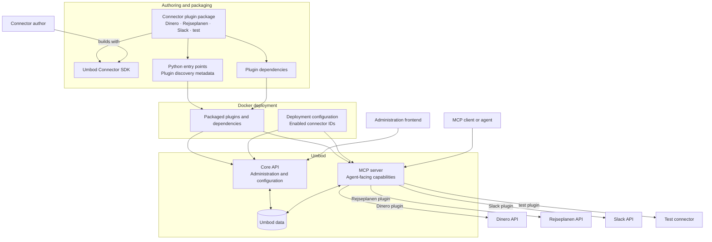
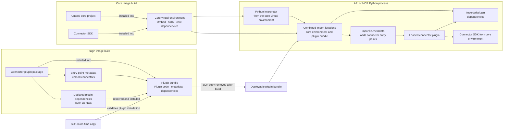

# Umbod Connector SDK

Public Python connector authoring API and plugin discovery contract for Umbod.

## Package

The SDK is published to PyPI as `umbod` (`pip install umbod`) and exposes the `umbod_sdk.connectors` Python package. It contains the public contracts used to implement connector plugins, including `umbod_sdk.connectors.plugin_api`, configuration models, registration contracts, uploaded files, and plugin discovery.

Concrete connector implementations belong in separate Python distributions. Umbod discovers installed connector distributions through Python package entry points and enables a deployment-specific subset through its connector deployment configuration.

## Plugin system overview

Connector authors build Python distributions against this SDK. The distribution publishes each plugin through the `umbod.connectors` entry-point group and declares its runtime dependencies as normal Python package dependencies.

Connector implementations are distributed separately from the SDK. Docker packages each connector distribution and its dependencies for use by Umbod.

Discovery and availability are separate controls. Entry points identify installed implementations; the Helm deployment availability configuration selects which connector IDs an environment enables.



The frontend obtains connector definitions and administration state through the core API. The MCP server discovers the enabled plugins and exposes their eligible capabilities to agents.

## Python runtime loading details

The core application and plugins are packaged separately, but they execute in the same Python interpreter. The core image provides the application virtual environment and the authoritative Connector SDK. The plugin image resolves each plugin package's declared dependencies into a separate bundle, which Docker makes available to both core processes.



There is no virtual environment per connector. The API process loads plugins into the API interpreter, and the MCP process loads plugins into the MCP interpreter. Within either process, all enabled plugins share one module namespace and dependency resolution context. Declaring a dependency in a plugin package ensures it is carried in the plugin bundle, but it does not isolate that dependency from core dependencies or dependencies declared by other plugins. Plugins that require mutually incompatible versions need a process or container boundary rather than additional in-process virtual environments.

## Creating a connector distribution

A connector distribution must:

1. Depend on a compatible `umbod` version.
2. Implement a connector using the public `umbod_sdk.connectors.plugin_api` interface.
3. Export the connector plugin object from an importable module.
4. Declare that exported object in the `umbod.connectors` entry-point group.
5. Be installed in the Python environment or plugin bundle used by Umbod.
6. Be enabled by connector ID in the deployment configuration.

A typical distribution layout is:

```text
my-umbod-connectors/
├── pyproject.toml
└── src/
    └── my_umbod_connectors/
        └── my_service/
            ├── __init__.py
            ├── admin_configuration.py
            ├── api_client.py
            └── configuration_check.py
```

The public [connector authoring guide](https://umbod.ai/docs/plugins/build-a-connector/) describes the supported image build and deployment workflow.

## Declaring plugin discovery metadata

Use the standardized Python package entry-point metadata in the connector distribution's `pyproject.toml`:

```toml
[project]
name = "my-umbod-connectors"
version = "0.1.0"
requires-python = ">=3.14"
dependencies = [
    "umbod>=0.1.0,<0.2.0",
]

[project.entry-points."umbod.connectors"]
my-service = "my_umbod_connectors.my_service:MyServiceConnectorPlugin"
```

Each entry has three parts:

- `my-service` is the entry-point name recorded in package metadata.
- `my_umbod_connectors.my_service` is the importable Python module.
- `MyServiceConnectorPlugin` is the plugin object exported by that module.

Umbod loads entries from the `umbod.connectors` group with `importlib.metadata`. An entry may resolve directly to a connector plugin object or to a callable that returns one.

The entry-point name identifies the package metadata entry, but deployment selection uses the ID declared by the loaded connector:

```python
connector = Connector(
    id="my-service",
    name="My Service",
    description="Connects agents to My Service.",
    configuration=MyServiceAdminConfiguration,
)

MyServiceConnectorPlugin = connector
```

Keep the entry-point name, `Connector.id`, and deployment configuration ID identical. Although discovery ultimately indexes the loaded plugin by `Connector.id`, using one stable identifier prevents ambiguity across packaging and deployment configuration. Connector IDs must be unique across all installed plugins.

## Enabling an installed connector

Installing a connector distribution makes its plugin discoverable; it does not automatically make the connector available in a deployment. The deployment configuration must also include its `Connector.id`:

```json
{
  "connectors": [
    {
      "id": "my-service"
    }
  ]
}
```

The Helm chart renders this availability configuration from `plugins.availableConnectorIds`.

The distinction is intentional:

- Entry-point metadata declares which connector implementations are installed and discoverable.
- Deployment configuration declares which discovered connectors are enabled in that environment.
- A discovered connector omitted from deployment configuration remains disabled.
- An enabled connector whose plugin is not discoverable causes startup validation to fail.

## Building and verifying the distribution

Use the versioned `ghcr.io/computerlovetech/umbod-connector-builder` image to lock dependencies and build the connector distribution. The image contains Python, `uv`, and the matching SDK. Package connector code, distribution metadata, and third-party runtime dependencies into the plugin bundle without copying the SDK. The matching Umbod core image validates the completed bundle before deployment.

## Directory-based development plugins

Umbod can also discover Python files from the directory selected by `UMBOD_CONNECTOR_PLUGIN_DIR`. Each non-private `.py` file may expose `plugin`, a `plugins` list, or plugin-shaped module values. This mechanism is intended for development and externally mounted plugin files. Installable connector distributions should use package entry points because entry points preserve package ownership, dependencies, versioning, and standard Python installation behavior.

## Package boundary

This SDK distribution contains only connector authoring and discovery contracts. Concrete connector implementations are distributed separately, such as the repository's `umbod-connectors` package.
