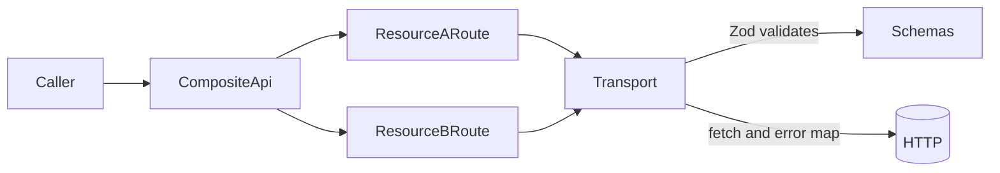

# API Client Architecture

## Purpose

This skill is the **HTTP specialization** of [ports and adapters for I/O](../ports-adapters-io/SKILL.md): read that skill for port-first design, Zod/Pydantic at boundaries, an in-memory adapter before real I/O, and tests against the port contract.

Here, keep every network boundary validated and bounded. All payloads crossing the network MUST be shaped by Zod schemas, and client code MUST be split by bounded context using a transport **port** and route **adapters**.

Canonical reference implementation in this repo: `frontend/src/lib/admin/infrastructure/`.

## When to Apply

Apply this skill whenever:

- Adding, removing, or changing an API endpoint call.
- Introducing a new external or internal service client.
- Refactoring code that calls `fetch` / HTTP libraries.
- Defining request or response types for a network payload.
- Reviewing a change under any `infrastructure/` folder.

## Required Architecture

Every network layer MUST be built from four parts:

1. **Schemas (source of truth)** — Zod schemas for every wire shape.
2. **Transport (port)** — interface that does fetch + validation + error mapping.
3. **Route classes (adapters per bounded context)** — one class per resource.
4. **Composite client** — a class that wires the routes over a single `Transport`.



## Schemas Are the Source of Truth

- Define every wire shape as a Zod schema in the `domain/` layer of the bounded context.
- Derive TypeScript types via `z.infer<typeof ...>`. Do NOT hand-write interfaces for wire types.
- Write separate schemas for requests (outbound bodies) and responses (inbound payloads). Do not reuse a response schema as a request body.
- Keep schemas colocated with the domain they describe, not inside `infrastructure/`.

### Handling Backend-Optional Fields

Backend services often serialize missing optional fields as `null` rather than omitting them. Plain `.optional()` only accepts `undefined` and will reject `null` at the edge.

Use a `nullishOptional` helper that accepts `null | undefined | T` on the wire and normalizes `null` to `undefined`:

```ts
function nullishOptional<T extends z.ZodType>(schema: T) {
  return z.preprocess((value) => (value === null ? undefined : value), schema.optional());
}
```

Apply `nullishOptional(...)` to any field whose backend contract is "optional" — even if the current payloads don't show `null`, treat it as a contract guarantee once and for all.

## Transport Is a Port

The transport is a small interface with a single `request` method. It MUST:

- Accept both an `inputSchema` (for bodies) and an `outputSchema` (for responses).
- Validate `body` against `inputSchema` BEFORE calling the network. Fail fast, do not let unvalidated payloads touch the wire.
- Parse the response JSON and validate against `outputSchema`. Throw a dedicated `SchemaValidationError` on failure, tagged with `'inbound' | 'outbound'`.
- Attach `Content-Type: application/json` only when a body is present.
- Own error-mapping strategy (HTTP status → typed error) via injected configuration.

Provide a factory per execution context (for example `browserTransport()`, `serverTransport(fetch)`). The only things that differ between factories are: the `fetch` implementation, base URL resolution, and the HTTP-failure handler.

## Route Classes Split By Bounded Context

- One route class per resource. Examples: `DomainsRoute`, `EntityTypesRoute`, `InstancesRoute`.
- A route class MUST only know paths and schemas for its own resource. Do not cross bounded contexts inside a single class.
- Methods correspond to operations on that resource (`list`, `get`, `update`, `create`, …). Each method declares its input and output schemas inline in the `transport.request({ ... })` call.
- Cross-resource convenience helpers (if needed) belong on the composite client, not inside a route.

## Composite Client Wires Everything

The composite `XxxApi` class takes a `Transport` in its constructor and exposes the route classes as readonly fields:

```ts
class AdminApi {
  readonly domains: DomainsRoute;
  readonly entityTypes: EntityTypesRoute;
  readonly instances: InstancesRoute;
  constructor(transport: Transport) {
    this.domains = new DomainsRoute(transport);
    this.entityTypes = new EntityTypesRoute(transport);
    this.instances = new InstancesRoute(transport);
  }
}
```

Callers use `api.domains.list()`, `api.instances.update(...)`, etc. — never `listDomains()` standalone unless a compat shim is explicitly warranted.

## Legacy Function Shims (Only If Needed)

If many call sites already import named functions and rewriting them would cause churn, keep a thin compat module that holds a module-level `new XxxApi(defaultTransport())` and delegates. The compat module contains zero fetch/validation logic of its own.

## Minimal Implementation Checklist

Before shipping a network-layer change, verify:

- [ ] Every request body has an `inputSchema`. No untyped `Record<string, unknown>` bodies reach `transport.request`.
- [ ] Every response has an `outputSchema`. No `response.json() as T` casts anywhere.
- [ ] Schemas live in `domain/`, not in `infrastructure/`.
- [ ] Types are `z.infer<typeof schema>`; no hand-written interfaces for wire shapes.
- [ ] Optional backend fields use `nullishOptional(...)`, not bare `.optional()`.
- [ ] One route class per bounded context. No cross-resource logic inside a route.
- [ ] Transport errors are translated in exactly one place (the transport factory), not per call site.
- [ ] Schema validation failures surface as a typed `SchemaValidationError` with direction (`inbound` | `outbound`) and the original Zod issues.

## Anti-Patterns

- Casting `await response.json()` to a TS interface. Validate through a Zod schema instead.
- Hand-written TS interfaces for wire shapes. Derive from Zod.
- Sharing a single schema between request and response. Split them.
- A god module with flat `async` functions that each call `fetch`. Use route classes.
- Duplicating base-URL or error-mapping logic at each call site. That belongs in the transport.
- Mixing two resources in the same route class. Split by bounded context.
- Treating `.optional()` as "nullable". Use `nullishOptional` when the backend may send `null`.
- Catching schema errors and silently falling back to the raw payload. Surface the `SchemaValidationError`.

## Tests

Follow [ports-adapters-io](../ports-adapters-io/SKILL.md): assert behavior through the **transport port** and **fake transport** (in-memory / no network), not implementation details of `fetch`.

- For every transport: test input validation blocks the network call, output validation rejects malformed payloads, and error mapping matches the transport's convention.
- For every route class: use a fake `Transport` that records the `{ method, path, body, inputSchema, outputSchema, notFoundMessage }` contract and assert against it.
- For every schema that normalizes backend nulls: a dedicated spec that parses an explicit-`null` payload and asserts normalization to `undefined`.
