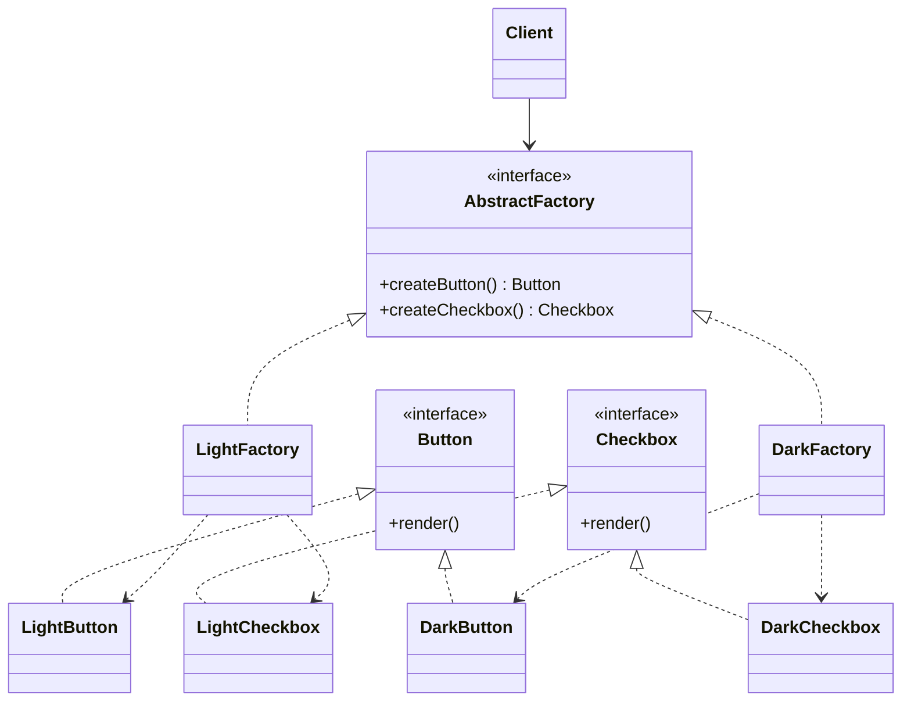

# Abstract Factory

Use when code must create several related products that must be compatible as a family.

## Shape

## Refactoring signal

Several constructors are selected together by the same condition: theme, platform, vendor, protocol, environment, region, or version. Bugs appear when products from different families are accidentally mixed.

## Implementation guide

1. Identify the family axis, such as `Windows`, `Mac`, `Light`, `Dark`, `Stripe`, or `Adyen`.
2. Define one abstract factory method per product role.
3. Define product interfaces for each role.
4. Implement one concrete factory per family.
5. Move all family-specific constructor calls into concrete factories.
6. Inject the factory into clients and remove family conditionals from client code.
7. Add a new family by adding a factory and product implementations.

## Use instead of

- Factory Method when multiple related product roles must vary together.
- Builder when the concern is stepwise construction of one complex object.
- Dependency injection container when domain compatibility rules must be explicit in code.

## Agent checklist

Match this pattern when the same discriminator controls several object creations and those objects must be used together.
