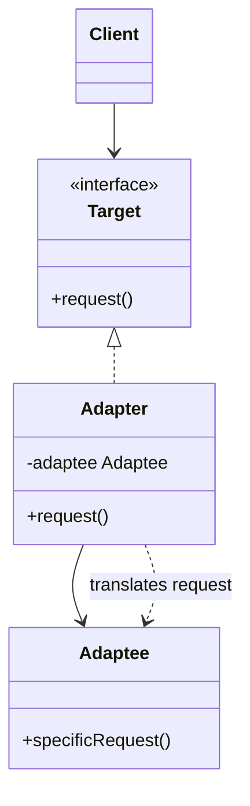

# Adapter

Use when an existing class has useful behavior but an incompatible interface.

## Shape

## Refactoring signal

Client code contains translation glue: renaming methods, converting units, mapping DTOs, wrapping exceptions, or reshaping third-party API responses before every call.

## Implementation guide

1. Define the interface the client wishes it had.
2. Create an adapter that implements that interface.
3. Store the incompatible object inside the adapter.
4. Translate method names, data formats, units, errors, and lifecycle rules in one place.
5. Inject the target interface into clients.
6. Keep adapter logic thin; do not add unrelated business policy.

## Use instead of

- Facade when only one interface mismatch must be fixed.
- Decorator when the interface should stay the same and behavior is added.
- Proxy when the same interface is preserved to control access.

## Agent checklist

Match this pattern when repeated boundary mapping hides inside clients near calls to an external or legacy API.
