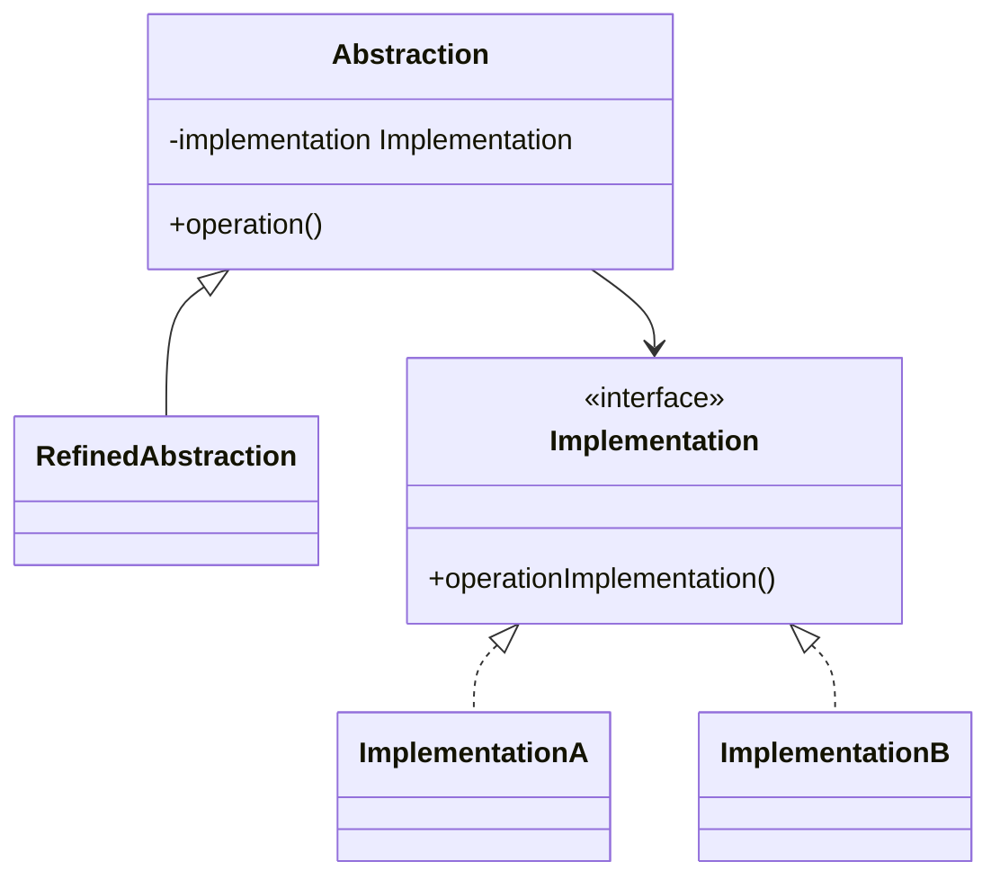

# Bridge

Use when an abstraction and its implementation vary independently and inheritance would create a Cartesian product of subclasses.

## Shape

## Refactoring signal

Class names combine two dimensions: `RemoteTv`, `RemoteRadio`, `AdvancedRemoteTv`, `AdvancedRemoteRadio`. New variants require multiplying subclasses.

## Implementation guide

1. Identify the high-level abstraction used by clients.
2. Identify the lower-level implementation axis that changes independently.
3. Extract the implementation interface.
4. Give the abstraction a reference to the implementation.
5. Move platform, device, vendor, or persistence details behind the implementation interface.
6. Let refined abstractions add high-level behavior without subclassing implementations.
7. Compose the desired pair at runtime.

## Use instead of

- Adapter when both sides are already incompatible and you only need translation.
- Strategy when the whole algorithm varies but there is no abstraction hierarchy.
- Abstract Factory when the main issue is creating compatible families.

## Agent checklist

Match this pattern when inheritance is being used to combine two independent axes of variation.
