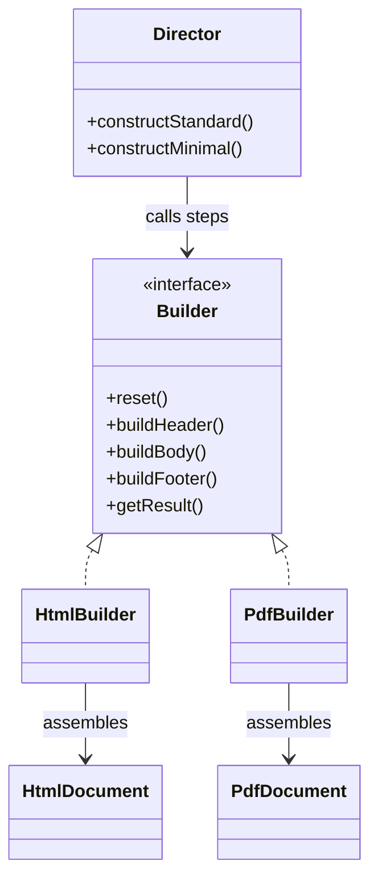

# Builder

Use when constructing one object requires many optional parts, ordered steps, validation, or alternative representations.

## Shape

## Refactoring signal

Constructors or factory calls have many parameters, many nulls, flags, optional lists, or repeated setup sequences. Several call sites build the same object in slightly different orders.

## Implementation guide

1. Create a builder that stores construction state internally.
2. Replace constructor parameters with named build steps.
3. Make each step return the builder when fluent composition helps readability.
4. Put final validation in `build` or `getResult`.
5. Add a director only when standard recipes are reused across clients.
6. Keep the product immutable after `build` when possible.
7. Use separate builders only when the same steps produce different representations.

## Use instead of

- Abstract Factory when you create one complex product rather than a family.
- Factory Method when construction does not need multiple steps.
- Telescoping constructors or boolean flags.

## Agent checklist

Match this pattern when object construction has grown into a mini-protocol and clients must know too much about valid assembly.
