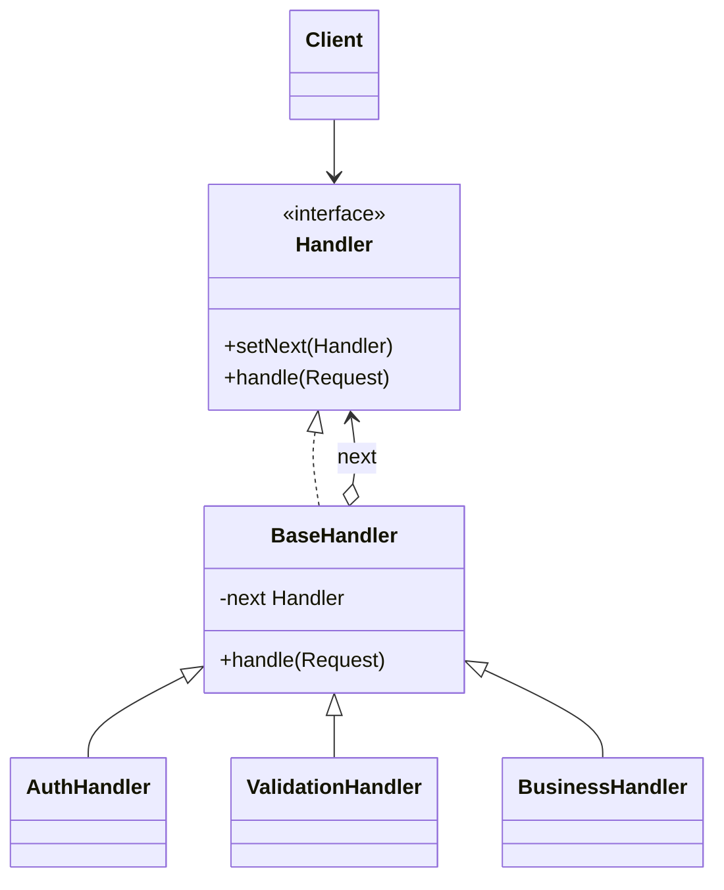

# Chain of Responsibility

Use when a request should pass through a sequence of handlers until one handles it or each contributes processing.

## Shape

## Refactoring signal

A method contains a long ordered list of checks, validators, filters, middleware, fallback resolvers, or `if canHandle` branches. The order changes by context.

## Implementation guide

1. Define a handler interface that accepts the request.
2. Move each processing step into a handler.
3. Store the next handler in a base handler when forwarding is common.
4. Let handlers either stop the chain or forward explicitly.
5. Build chains in composition code, not inside handlers.
6. Make chain ordering visible and testable.

## Use instead of

- Strategy when exactly one algorithm should be chosen.
- Decorator when wrappers all implement the same object API rather than processing a request.
- Command when requests must be stored or undone.

## Agent checklist

Match this pattern when ordered handlers can be extracted from a conditional pipeline.
