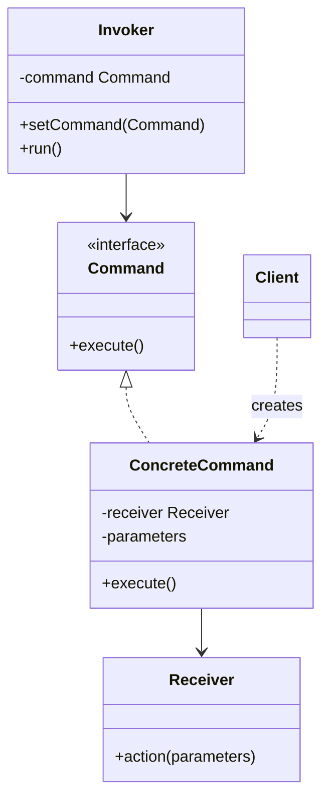

# Command

Use when a request must become an object that can be queued, logged, retried, undone, scheduled, or parameterized.

## Shape

## Refactoring signal

UI buttons, jobs, API actions, or event handlers directly call receivers with duplicated parameters. You need undo, audit log, macro recording, queues, retries, or delayed execution.

## Implementation guide

1. Define a command interface with `execute`.
2. Move each action into a concrete command.
3. Store the receiver and parameters inside the command.
4. Let invokers depend only on the command interface.
5. Add `undo` only when the command captures enough previous state.
6. Serialize commands only if all needed parameters can be represented safely.

## Use instead of

- Strategy when the caller executes an algorithm immediately and no request object is needed.
- Chain of Responsibility when several handlers may process the same request.
- Memento when only state snapshots are needed.

## Agent checklist

Match this pattern when behavior needs to be passed around as data with execution semantics.
