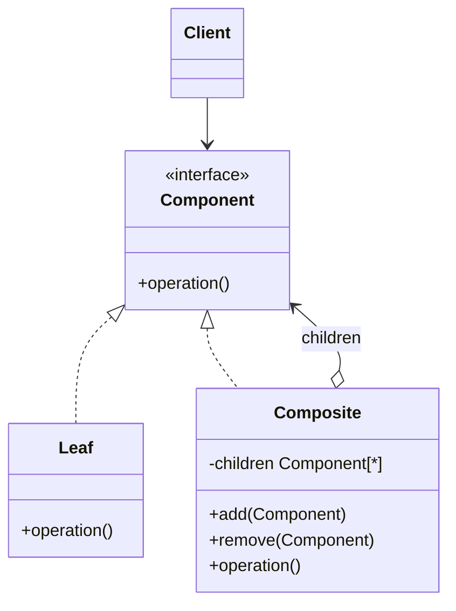

# Composite

Use when clients should treat individual objects and groups of objects uniformly as a tree.

## Shape

## Refactoring signal

Code recursively traverses tree-like structures with separate handling for folders versus files, groups versus items, containers versus widgets, organizations versus employees.

## Implementation guide

1. Extract the common operation clients need from both leaves and containers.
2. Implement it directly in leaves.
3. Implement it in composites by delegating to children and combining results.
4. Store children as the component interface.
5. Decide whether child management belongs on the component interface or only the composite.
6. Keep parent traversal, cycle prevention, and ordering rules explicit.

## Use instead of

- Decorator when the wrapper has exactly one wrapped component.
- Chain of Responsibility when objects form a processing chain, not a part-whole tree.
- Iterator when the issue is traversal only, not uniform operations.

## Agent checklist

Match this pattern when `isContainer` branches or recursive type checks appear around tree operations.
