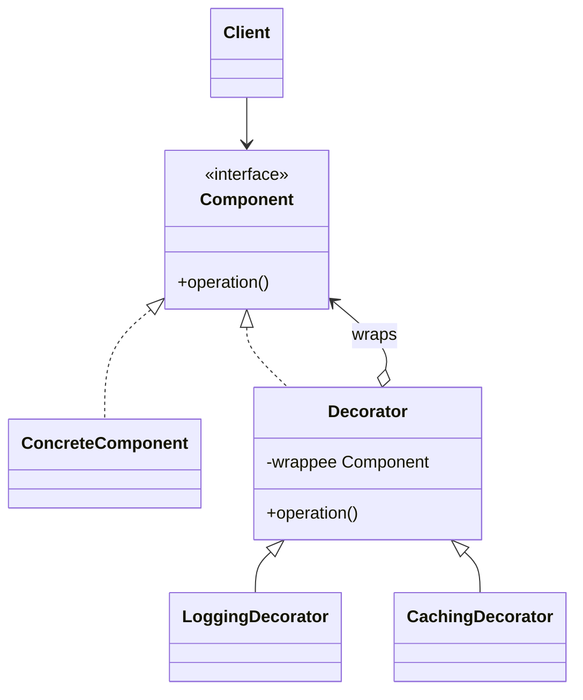

# Decorator

Use when responsibilities must be added to an object dynamically while preserving the same interface.

## Shape

## Refactoring signal

Subclasses represent feature combinations: `CompressedEncryptedStream`, `BufferedCompressedEncryptedStream`. Or client code applies optional pre/post behavior around the same call.

## Implementation guide

1. Extract or reuse the component interface.
2. Create a base decorator implementing the same interface and storing a component.
3. Forward calls to the wrapped component by default.
4. Implement each optional responsibility in its own decorator.
5. Compose decorators in the order behavior should run.
6. Keep each decorator focused on one concern.

## Use instead of

- Proxy when the purpose is access control or lazy access rather than added responsibility.
- Adapter when the interface changes.
- Composite when the wrapper manages many children.

## Agent checklist

Match this pattern when subclass count grows from combinations of optional behaviors around one core object.
