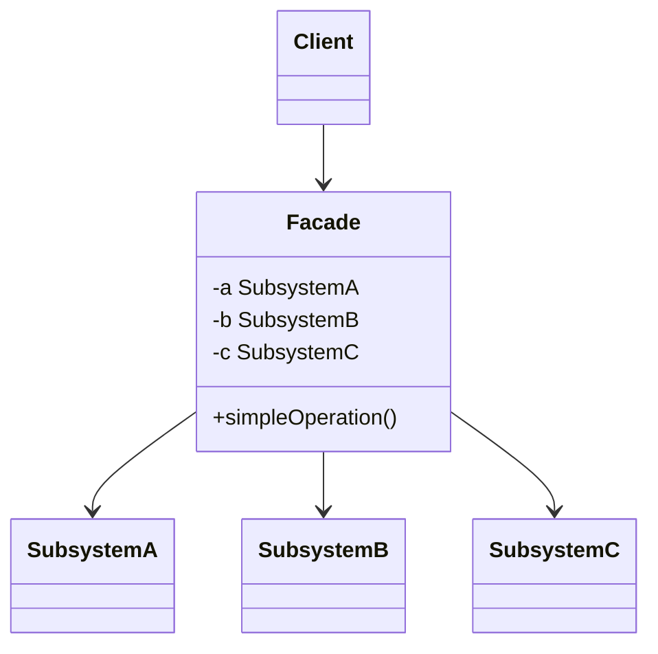

# Facade

Use when a subsystem is useful but too complex, coupled, or low-level for most clients.

## Shape

## Refactoring signal

Many call sites repeat the same sequence across several subsystem classes: configure, authenticate, load, transform, save, notify. Clients know too much about subsystem order and dependencies.

## Implementation guide

1. Identify common use cases clients perform against the subsystem.
2. Create a facade with intention-revealing methods for those use cases.
3. Move orchestration, default configuration, and error normalization into the facade.
4. Keep advanced subsystem access available when necessary.
5. Avoid turning the facade into a dumping ground for unrelated operations.
6. Inject subsystem dependencies into the facade.

## Use instead of

- Adapter when there is one incompatible interface.
- Mediator when peer objects communicate through a coordinator.
- Service layer when the concern is business transaction boundaries across domain objects.

## Agent checklist

Match this pattern when duplicated subsystem choreography leaks into many clients.
