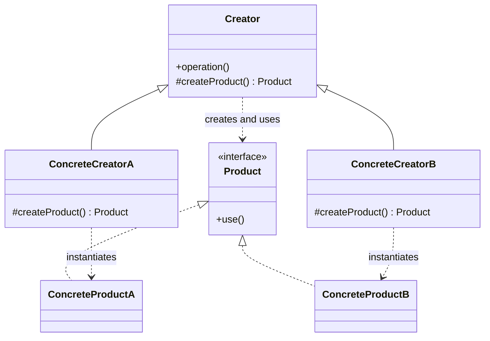

# Factory Method

Use when object creation varies by product type, but the client workflow around the product is stable.

## Shape

## Refactoring signal

Construction logic is mixed into a class that also runs a business workflow. You see `if type ==`, `switch kind`, or duplicated setup branches that differ only in which concrete object is created.

## Implementation guide

1. Define a `Product` interface around what the creator actually needs.
2. Move the common workflow into `Creator.operation`.
3. Replace direct construction inside the workflow with `createProduct`.
4. Put each concrete construction path into a `ConcreteCreator` override.
5. Keep product initialization inside the factory method, not scattered through clients.
6. Let callers choose a creator, not a product class.

## Use instead of

- Simple constructor when there is only one product and no variation point.
- Abstract Factory when you only create one product family member.
- Strategy when the variation is behavior after creation, not creation itself.

## Agent checklist

Match this pattern when a class owns a stable algorithm and one step says “make the right object”. The refactoring candidate is the creation branch inside the algorithm.
