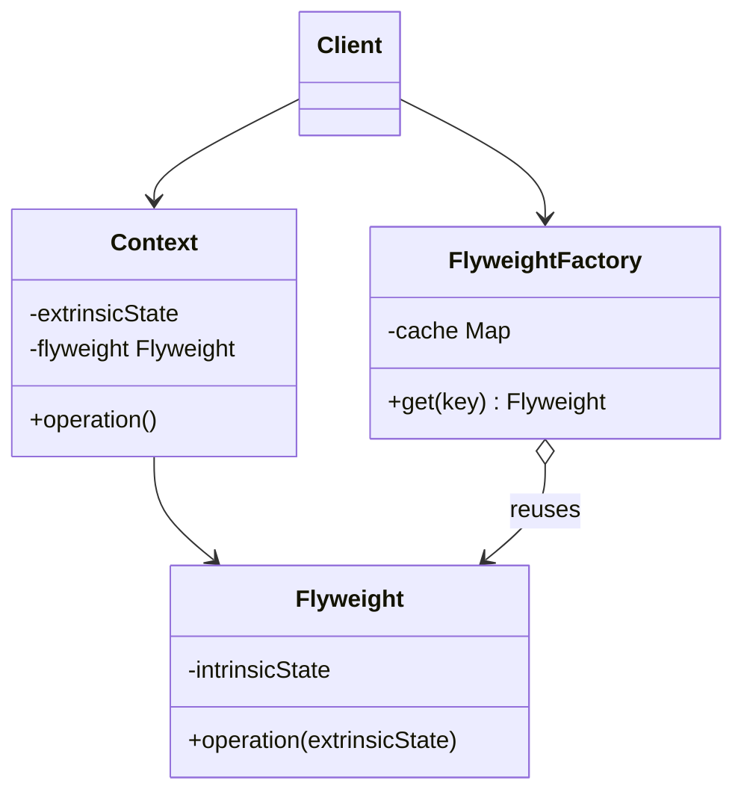

# Flyweight

Use when many objects repeat the same immutable data and memory or creation cost matters.

## Shape

## Refactoring signal

Large collections contain many objects with identical immutable fields: glyphs, particles, map tiles, permissions, colors, product metadata, parsed formats.

## Implementation guide

1. Split state into intrinsic shared state and extrinsic per-use state.
2. Make flyweights immutable.
3. Store intrinsic state in flyweight objects.
4. Pass extrinsic state into operations or keep it in lightweight context objects.
5. Add a factory that returns cached flyweights by intrinsic-state key.
6. Measure memory or creation cost before and after; this pattern is optimization-heavy.

## Use instead of

- Singleton when there are many shared instances keyed by state.
- Prototype when you need copies, not sharing.
- Value Object when memory pressure is not a concern.

## Agent checklist

Match this pattern only when repeated immutable state appears at scale and sharing will materially reduce cost.
