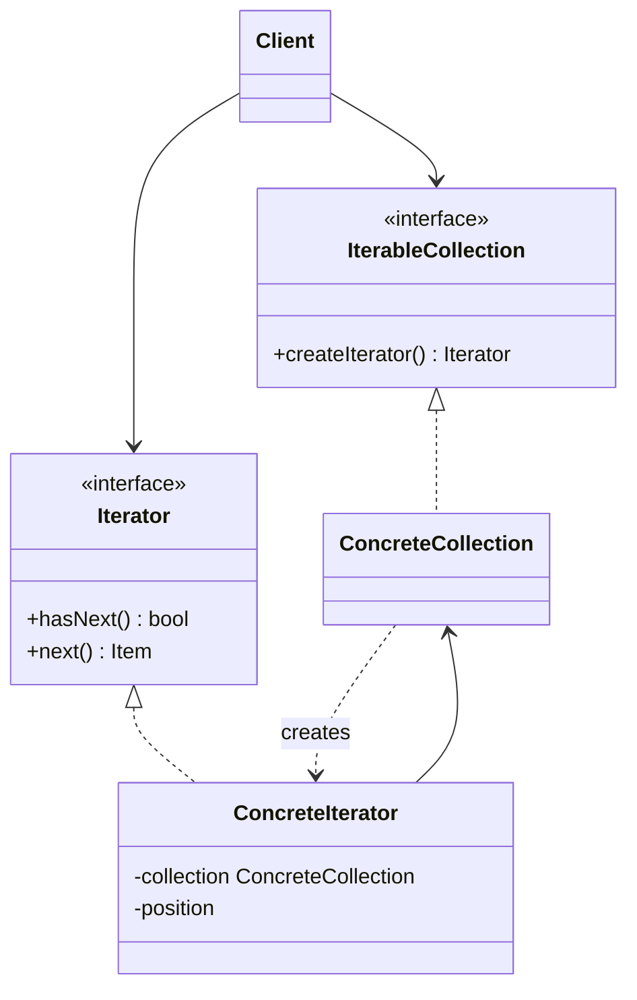

# Iterator

Use when clients need sequential access to a collection without knowing its representation.

## Shape

## Refactoring signal

Clients access collection internals: indexes, tree nodes, cursors, linked-list pointers, pagination tokens, or traversal stacks. Multiple traversal styles duplicate logic.

## Implementation guide

1. Define an iterator protocol around `next` and completion checks.
2. Move traversal state into the iterator.
3. Let the collection create iterators.
4. Keep collection representation hidden.
5. Add separate iterators for depth-first, breadth-first, filtered, reverse, or paged traversal.
6. Decide how mutation during iteration behaves.

## Use instead of

- Composite when the issue is uniform tree behavior, not traversal exposure.
- Visitor when external operations over many element types are needed.
- Generator syntax when language-native iteration is sufficient.

## Agent checklist

Match this pattern when traversal knowledge leaks outside the collection.
