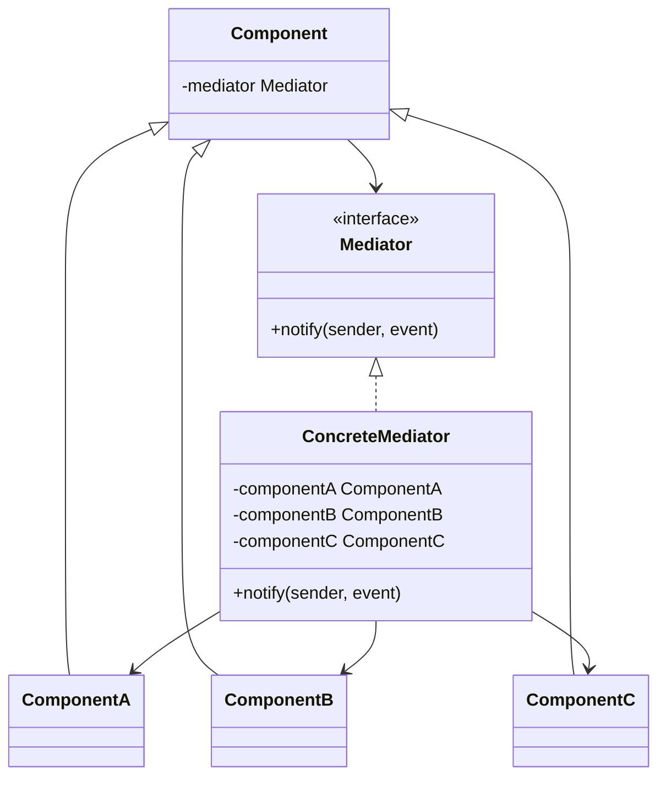

# Mediator

Use when many peer objects communicate directly and the collaboration rules should be centralized.

## Shape

## Refactoring signal

Objects call each other in a dense graph: forms updating fields, UI widgets enabling controls, services triggering each other, workflow steps coordinating peers.

## Implementation guide

1. Identify the collaboration cluster with excessive peer references.
2. Define mediator notifications in domain terms.
3. Give components a mediator reference instead of references to each other.
4. Move coordination rules into the concrete mediator.
5. Keep component behavior local; keep cross-component decisions in the mediator.
6. Split mediators when they become unrelated workflow hubs.

## Use instead of

- Observer when publishers should not know who reacts and no central rule engine is needed.
- Facade when clients need a simple API over a subsystem.
- Chain of Responsibility when requests move through ordered handlers.

## Agent checklist

Match this pattern when peer-to-peer references form a tangled collaboration graph.
