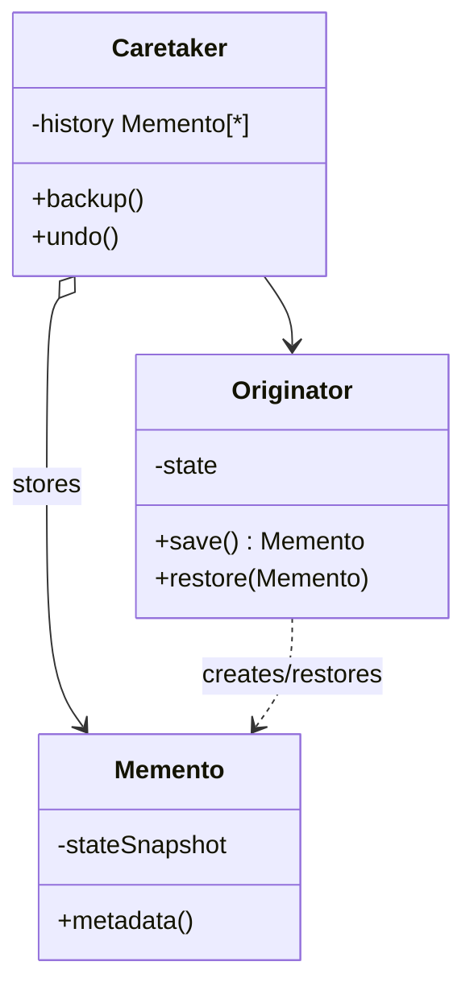

# Memento

Use when an object must restore previous state without exposing its internals.

## Shape

## Refactoring signal

Undo or rollback code reads and writes private fields from outside the object, or snapshots are represented as loose dictionaries that mirror internal state.

## Implementation guide

1. Let the originator create an opaque snapshot of its own state.
2. Store snapshots in a caretaker history.
3. Let only the originator restore from the snapshot.
4. Keep memento contents inaccessible to external code except safe metadata.
5. Choose full snapshots, diffs, or event history based on state size and performance.
6. Define history limits and lifecycle cleanup.

## Use instead of

- Command undo when each action can reverse itself cleanly.
- Prototype when copies are used as new working objects, not private rollback snapshots.
- Event sourcing when auditability and replay are core architecture needs.

## Agent checklist

Match this pattern when rollback requires preserving encapsulation of mutable state.
