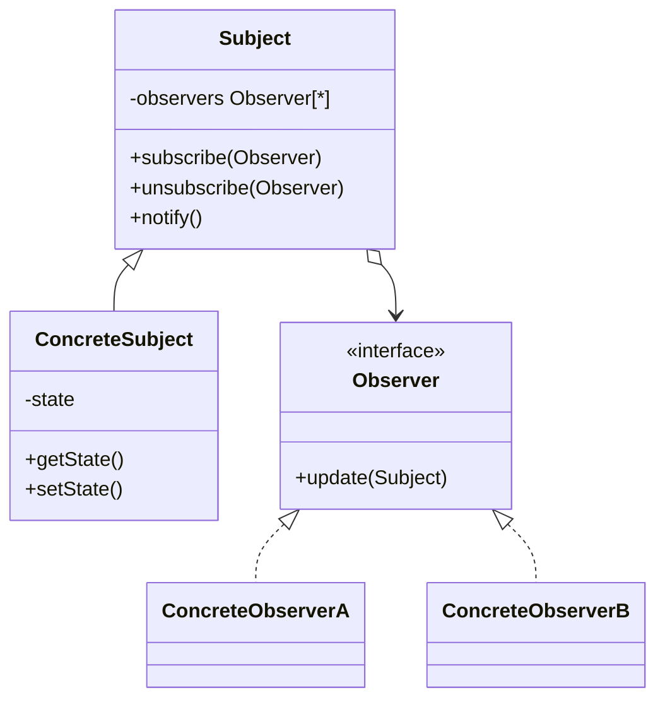

# Observer

Use when one object changes state and many unknown or changing dependents must react.

## Shape

## Refactoring signal

After a state change, code manually calls many dependents: update cache, refresh UI, send event, invalidate report, notify plugin. New reactions require editing the subject.

## Implementation guide

1. Define an observer interface or callback shape.
2. Add subscription management to the subject or event source.
3. Notify observers after the relevant state transition.
4. Decide whether notifications push data or let observers pull it.
5. Handle unsubscribe, ordering, exceptions, and memory leaks explicitly.
6. Keep subject independent from concrete observers.

## Use instead of

- Mediator when reaction rules among components must be centrally coordinated.
- Chain of Responsibility when a request should be handled by an ordered pipeline.
- Command when events must be durable executable requests.

## Agent checklist

Match this pattern when a source is edited repeatedly to add more side effects for state changes.
