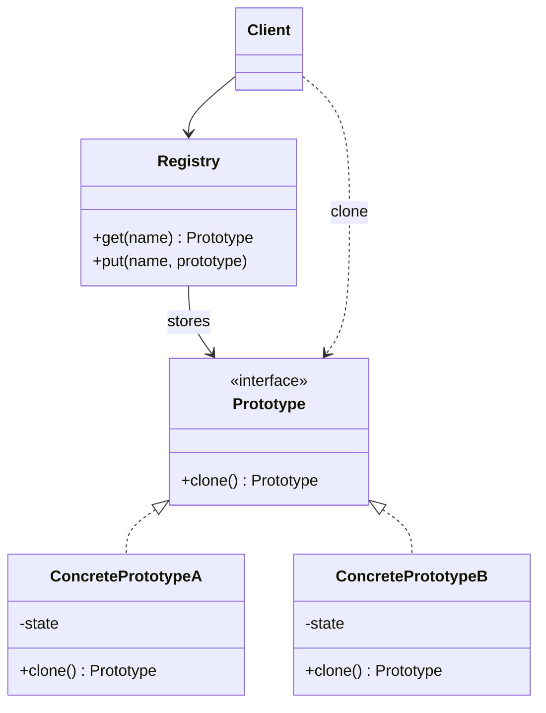

# Prototype

Use when new objects should be created by copying configured examples instead of rebuilding them from scratch.

## Shape

## Refactoring signal

Creating an object requires expensive setup, database-loaded defaults, runtime configuration, or hidden concrete classes. Code repeats “create then copy fields from template” logic.

## Implementation guide

1. Add a cloning operation to the product hierarchy.
2. Decide whether cloning is shallow, deep, or mixed per field.
3. Encapsulate copy rules inside each concrete prototype.
4. Use a registry when clients choose prototypes by name or configuration.
5. Clone first, then apply small differences.
6. Avoid exposing copy constructors with long parameter lists.

## Use instead of

- Factory Method when creation depends on existing configured instances.
- Builder when a caller needs explicit construction steps.
- Singleton when you need many similar instances, not one global instance.

## Agent checklist

Match this pattern when “new instance” really means “duplicate this configured specimen and tweak it”.
