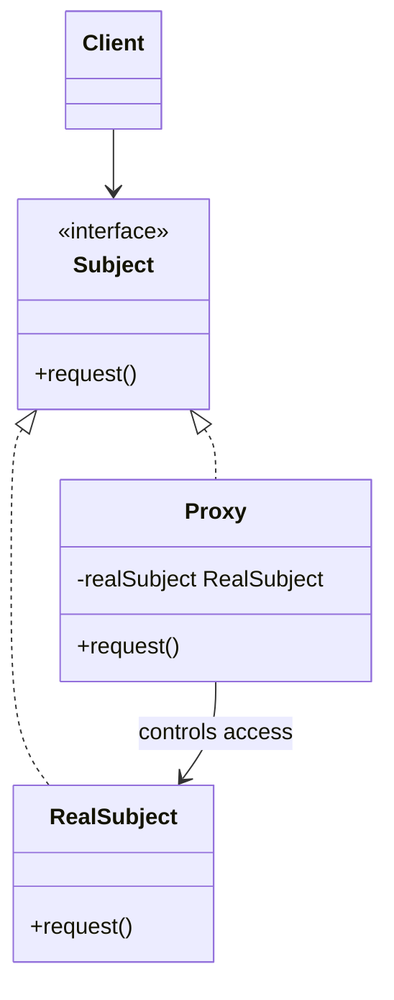

# Proxy

Use when a stand-in should control access to another object while keeping the same interface.

## Shape

## Refactoring signal

Clients repeat access checks, lazy initialization, remote call handling, caching, rate limiting, transaction boundaries, or logging around calls to one object.

## Implementation guide

1. Extract the subject interface from the real object.
2. Create a proxy implementing the same interface.
3. Store or lazily create the real subject inside the proxy.
4. Add the access-control behavior before, after, or around forwarding.
5. Replace client dependencies on the real subject with the subject interface.
6. Keep the proxy substitutable; clients should not need to know it is a proxy.

## Use instead of

- Decorator when the goal is optional feature stacking.
- Adapter when the interface changes.
- Facade when simplifying many subsystem objects.

## Agent checklist

Match this pattern when clients need the same object API but object access itself must be controlled.
