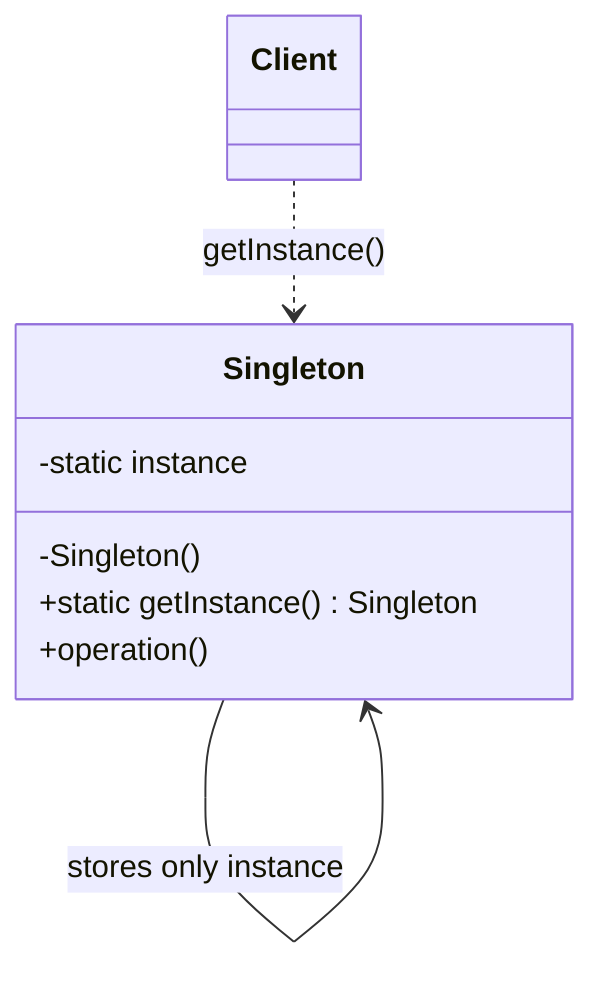

# Singleton

Use only when exactly one instance must coordinate access to a process-wide resource and that uniqueness is part of the domain constraint.

## Shape

## Refactoring signal

A resource manager is manually passed everywhere or recreated accidentally: process configuration, lock manager, metrics sink, service registry, or hardware handle.

## Implementation guide

1. Make construction private or otherwise inaccessible.
2. Store the sole instance behind a static accessor or module-level binding.
3. Make initialization thread-safe when runtime supports concurrency.
4. Keep mutable global state minimal and explicit.
5. Provide test seams through interfaces or dependency injection.
6. Prefer application composition roots over direct global access when possible.

## Use instead of

- Dependency injection when uniqueness is not a hard invariant.
- Module constants when no behavior or lifecycle exists.
- Service Locator when clients should not look up arbitrary dependencies.

## Agent checklist

Match this pattern cautiously. A global accessor alone is not enough; there must be a real single-instance invariant.
