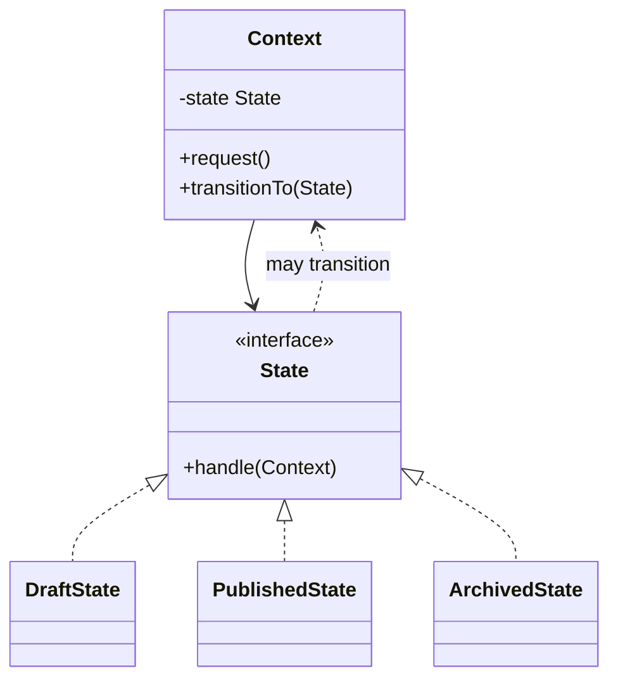

# State

Use when an object changes behavior according to its internal state and state transitions are explicit.

## Shape

## Refactoring signal

Methods contain repeated `switch status` or `if state` blocks. Adding a new state requires editing many methods. Certain operations are valid only in specific states.

## Implementation guide

1. Extract a state interface with operations that vary by state.
2. Move each state-specific branch into a concrete state.
3. Store the current state in the context.
4. Delegate state-dependent operations from context to state.
5. Put transition rules in states or in the context, but choose one clear owner.
6. Make invalid transitions explicit failures.

## Use instead of

- Strategy when algorithms are selected externally and do not transition themselves.
- Template Method when the variation is fixed inheritance steps.
- Enum conditionals when behavior is trivial and stable.

## Agent checklist

Match this pattern when the same state discriminator drives behavior across several methods.
