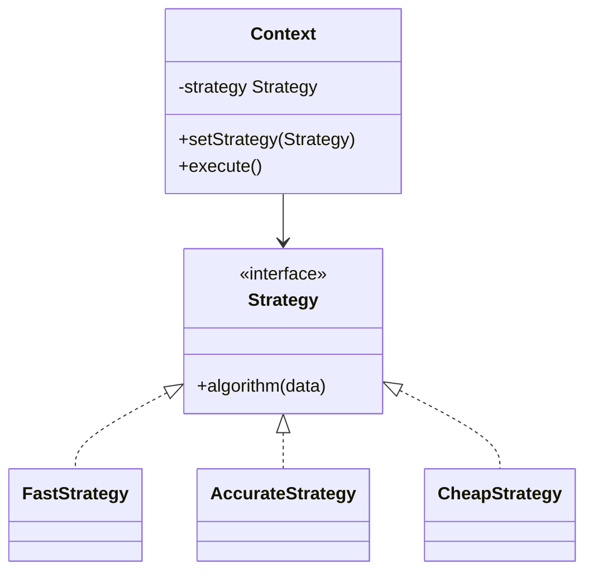

# Strategy

Use when interchangeable algorithms should be selected without changing the client that uses them.

## Shape

## Refactoring signal

A method chooses among algorithms by flags, enum values, configuration, customer type, sorting mode, pricing rule, validation mode, or compression type.

## Implementation guide

1. Extract the algorithm interface from the varying branch.
2. Move each algorithm into a concrete strategy.
3. Inject or select the strategy outside the context when possible.
4. Keep the context responsible for orchestration and the strategy responsible for the algorithm.
5. Make strategy inputs explicit to avoid hidden context coupling.
6. Use a registry when strategies are selected by configuration keys.

## Use instead of

- State when behavior changes because of internal lifecycle transitions.
- Command when the behavior must be queued, stored, undone, or logged as an object.
- Template Method when the algorithm skeleton is fixed by inheritance.

## Agent checklist

Match this pattern when one algorithm slot has several interchangeable implementations.
