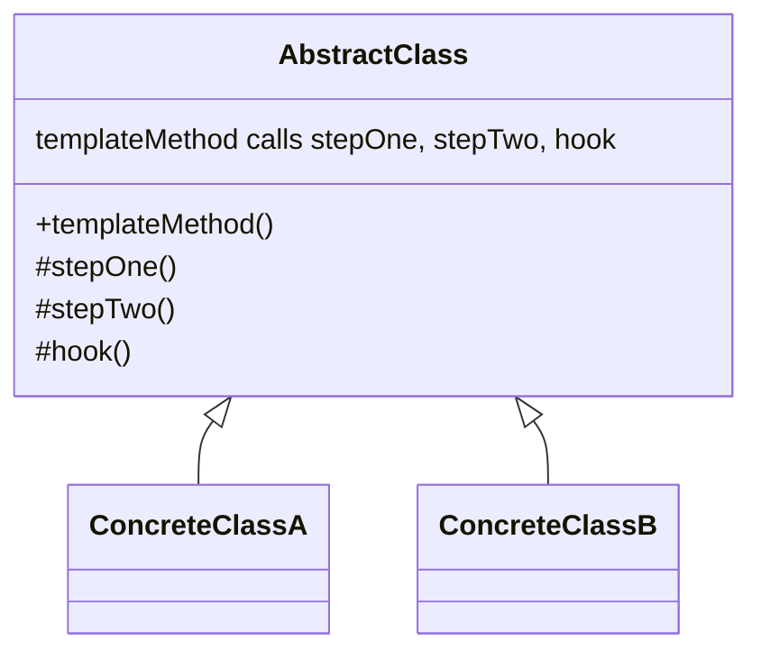

# Template Method

Use when subclasses share an algorithm skeleton but need to customize selected steps.

## Shape

## Refactoring signal

Several subclasses or sibling functions duplicate the same control flow but differ in a few steps. The order of steps must be enforced consistently.

## Implementation guide

1. Pull the shared algorithm order into a base method.
2. Extract varying operations into protected primitive methods.
3. Provide default hooks only for truly optional variation.
4. Make the template method non-overridable when the order must not change.
5. Keep subclass responsibility narrow.
6. Prefer composition if subclass count or inheritance coupling becomes painful.

## Use instead of

- Strategy when algorithms should be swapped at runtime through composition.
- Factory Method when the varying step is only object creation.
- Chain of Responsibility when steps are dynamically assembled.

## Agent checklist

Match this pattern when duplicated algorithms differ only in named steps and inheritance is acceptable.
