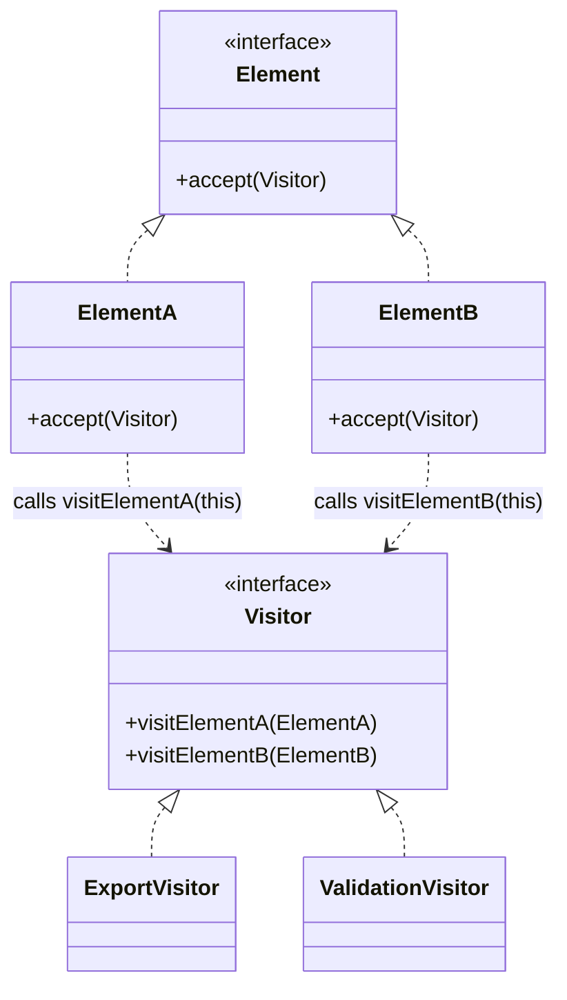

# Visitor

Use when many operations must be performed over a stable object structure with multiple concrete element types.

## Shape

## Refactoring signal

Operations over a class hierarchy are implemented with type checks, casts, or external switch statements. New operations are added more often than new element types.

## Implementation guide

1. Add `accept(visitor)` to the element interface.
2. Implement `accept` in each concrete element by calling the matching visitor method.
3. Define one visitor method per concrete element type.
4. Move each external operation into a concrete visitor.
5. Traverse object structures separately, passing the visitor to each element.
6. Avoid Visitor when element types change frequently.

## Use instead of

- Strategy when there is one algorithm slot, not many operations over many element types.
- Iterator when the issue is traversal only.
- Pattern matching when the language gives exhaustive matching and operations are few.

## Agent checklist

Match this pattern when type-based operation code grows outside a stable element hierarchy.
