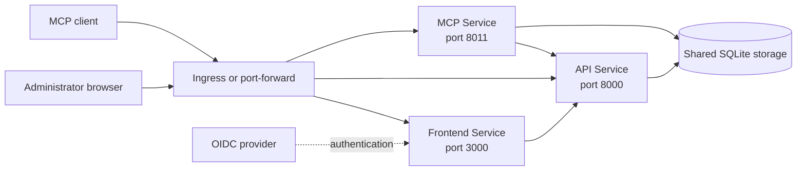

# Service topology

The Helm chart deploys Umbod as a core Pod and a frontend Pod. The core Pod runs the API and MCP containers with shared SQLite storage.

## Runtime services

| Service | Responsibility | Service port |
| --- | --- | ---: |
| `frontend` | Administration interface and server-side UI routes | 3000 |
| `api` | REST API, configuration, administration, and persistence | 8000 |
| `mcp` | MCP endpoint and agent-facing tools | 8011 |

The API exposes metrics in the core Pod on port `8001`. The MCP container exposes metrics on port `8012`.

## Workloads and storage

The chart runs API and MCP as containers in one fixed, single-replica core Deployment. Both containers mount the same data volume at `/app/data`. The frontend runs in a separate Deployment.

Without persistence, the chart uses an ephemeral `emptyDir` volume. With `persistence.enabled=true`, it mounts a ReadWriteOnce PersistentVolumeClaim. Umbod does not migrate SQLite schemas or persisted documents between incompatible versions.

## Traffic boundaries

- Browser traffic reaches the frontend Service through an Ingress or a local port-forward.
- The frontend reaches the API Service inside the cluster.
- MCP clients reach the MCP Service through the configured public origin.
- Shared installations use the configured OIDC provider for authentication.
- The optional Ingress routes frontend, API, and MCP paths according to the chart values.

See [Endpoints and ports](../reference/endpoints-and-ports.md) for service ports and local access commands.
