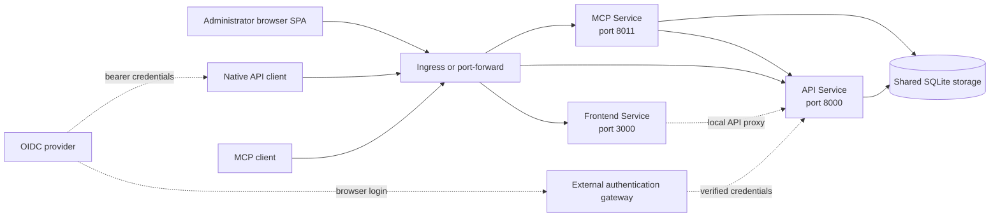

# Service topology

The Helm chart deploys Umbod as a core Pod and a frontend Pod. The core Pod runs the API and MCP containers with shared SQLite storage.

```mermaid
flowchart LR
    Admin[Administrator browser SPA] --> Ingress[Ingress or port-forward]
    Native[Native API client] --> Ingress
    Client[MCP client] --> Ingress
    Ingress --> Frontend[Frontend Service<br/>port 3000]
    Ingress --> API[API Service<br/>port 8000]
    Ingress --> MCP[MCP Service<br/>port 8011]
    Frontend -. local API proxy .-> API
    MCP --> API
    API --> Data[(Shared SQLite storage)]
    MCP --> Data
    Identity[OIDC provider] -. browser login .-> Gateway[External authentication gateway]
    Gateway -. verified credentials .-> API
    Identity -. bearer credentials .-> Native
```

## Runtime services

| Service | Responsibility | Service port |
| --- | --- | ---: |
| `frontend` | Static SvelteKit SPA assets, public runtime configuration, and local API routing; no Node runtime | 3000 |
| `api` | REST API, configuration, administration, and persistence | 8000 |
| `mcp` | MCP endpoint and agent-facing tools | 8011 |

The API exposes metrics in the core Pod on port `8001`. The MCP container exposes metrics on port `8012`.

## Workloads and storage

The chart runs API and MCP as containers in one fixed, single-replica core Deployment. Both containers mount the same data volume at `/app/data`. The frontend runs in a separate Deployment.

Without persistence, the chart uses an ephemeral `emptyDir` volume. With `persistence.enabled=true`, it mounts a ReadWriteOnce PersistentVolumeClaim. Umbod does not migrate SQLite schemas or persisted documents between incompatible versions.

## Traffic boundaries

- Browsers load static assets from the frontend Service and make requests to `/api/admin` directly. Production Ingress routes `/api` to the Python API without stripping the prefix.
- Local frontend port-forwards and Docker Compose use an nginx API proxy so browser requests remain same-origin. This proxy performs no application operations.
- Native clients use `/api/admin` with bearer credentials. The Python API does not mount legacy `/admin` routes.
- The Python API owns authorization, persistence, and connector setup. Browser route guards are not an authorization boundary.
- Shared installations supply an external authentication gateway for browser login and credential forwarding. The chart does not install this gateway. API failures must remain JSON responses rather than redirects to login HTML.
- Cookie-bearing mutations require a trusted `Origin` and `X-Umbod-Web-Request: 1`; native bearer requests without cookies do not use the browser CSRF contract.
- MCP clients reach the MCP Service through the configured public origin. Administrative authentication must not blanket-protect MCP OAuth discovery or OTLP routes.
- `/app-config.json` contains only browser-visible API and MCP addresses and public Auth0/logout configuration. Static assets contain no backend credentials or private environment configuration.

## Compose browser authentication

The optional `auth` Compose profile uses the pinned OAuth2 Proxy v7.6 gateway. Traefik routes browser pages to this gateway, which proxies authenticated requests to `frontend:3000`; it does not replace a 401 with a login HTML body. `/api/` retains higher-priority direct Python routing with only `/oauth2/auth` forward authentication. Missing sessions return 401 without a login redirect. Browser-page routers strip gateway credential and identity response headers before sending HTML or assets to browsers; this stripping does not apply to internal API forward authentication or OAuth endpoint routers. OAuth endpoints have highest priority, while favicon paths and exactly `/signed-out.html` go directly to the frontend without authentication.

The inline `oauth2-proxy-alpha` Compose config defines the OIDC provider, frontend upstream and credential headers. It fixes the authorization audience to `UMBOD_OIDC_AUDIENCE` without caller overrides and preserves `X-Auth-Request-Access-Token` for backend validation. Do not mix alpha options with removed legacy provider, upstream or header flags. Backend issuer, audience and administrator-membership checks remain independent and unchanged.

Logout visits `/oauth2/sign_out` with an encoded `rd` pointing to the configured Auth0 `/v2/logout` endpoint, configured client ID and fixed signed-out return URL. Register that URL in Auth0 **Allowed Logout URLs**; production uses `https://umbod-admin.computerlove.tech/signed-out.html`. Set `UMBOD_PUBLIC_SITE_ORIGIN` without a trailing slash and `UMBOD_PUBLIC_SITE_HOST` to its exact host, including a nonstandard port. The redirect allowlist includes only that host and the configured `UMBOD_OIDC_DOMAIN`. Logout clears the gateway cookie and Auth0 application session; it does not revoke existing tokens or promise logout from other identity-provider sessions.

Production frontend `PUBLIC_AUTH0_DOMAIN`, `PUBLIC_AUTH0_CLIENT_ID` and `PUBLIC_LOGOUT_RETURN_URL` are browser-visible values derived from the gateway deployment settings, not backend secrets. Local Compose defaults all three to empty, generating `logout: null` and gateway-only logout. Optional full Auth0 logout locally requires explicitly setting all three public variables to the actual configured Auth0 domain/client and an HTTPS `/signed-out.html` return URL registered in Auth0 Allowed Logout URLs. Default local development still accesses the frontend directly at port 3010 without starting the auth profile. Shared authenticated installations require correct public origins, callback registration, logout registration and proxy secrets. Compose validation must use `config --quiet` to avoid printing resolved secrets.

See [Endpoints and ports](../reference/endpoints-and-ports.md) for service ports and local access commands.
