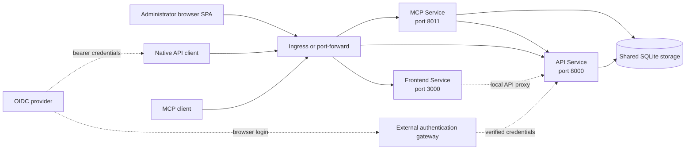

# Service topology

The Helm chart deploys Umbod as a core Pod and a frontend Pod. The core Pod runs the API and MCP containers with shared SQLite storage.

```mermaid
flowchart LR
    Admin[Administrator browser SPA] --> Ingress[Ingress or port-forward]
    Native[Native API client] --> Ingress
    Client[MCP client] --> Ingress
    Ingress --> Frontend[Frontend Service<br/>port 3000]
    Ingress --> API[API Service<br/>port 8000]
    Ingress --> MCP[MCP Service<br/>port 8011]
    Frontend -. local API proxy .-> API
    MCP --> API
    API --> Data[(Shared SQLite storage)]
    MCP --> Data
    Identity[OIDC provider] -. browser login .-> Gateway[External authentication gateway]
    Gateway -. verified credentials .-> API
    Identity -. bearer credentials .-> Native
```

## Runtime services

| Service | Responsibility | Service port |
| --- | --- | ---: |
| `frontend` | Static SvelteKit SPA assets, public runtime configuration, and local API routing; no Node runtime | 3000 |
| `api` | REST API, configuration, administration, and persistence | 8000 |
| `mcp` | MCP endpoint and agent-facing tools | 8011 |

The API exposes metrics in the core Pod on port `8001`. The MCP container exposes metrics on port `8012`.

## Workloads and storage

The chart runs API and MCP as containers in one fixed, single-replica core Deployment. Both containers mount the same data volume at `/app/data`. The frontend runs in a separate Deployment.

Without persistence, the chart uses an ephemeral `emptyDir` volume. With `persistence.enabled=true`, it mounts a ReadWriteOnce PersistentVolumeClaim. Umbod does not migrate SQLite schemas or persisted documents between incompatible versions.

## Traffic boundaries

- Browsers load static assets from the frontend Service and make requests to `/api/admin` directly. Production Ingress routes `/api` to the Python API without stripping the prefix.
- Local frontend port-forwards and Docker Compose use an nginx API proxy so browser requests remain same-origin. This proxy performs no application operations.
- Native clients use `/api/admin` with bearer credentials. The Python API does not mount legacy `/admin` routes.
- The Python API owns authorization, persistence, and connector setup. Browser route guards are not an authorization boundary.
- Shared installations supply an external authentication gateway for browser login and credential forwarding. The chart does not install this gateway. API failures must remain JSON responses rather than redirects to login HTML.
- Cookie-bearing mutations require a trusted `Origin` and `X-Umbod-Web-Request: 1`; native bearer requests without cookies do not use the browser CSRF contract.
- MCP clients reach the MCP Service through the configured public origin. Administrative authentication must not blanket-protect MCP OAuth discovery or OTLP routes.
- `/app-config.json` contains only browser-visible API and MCP addresses. Static assets contain no backend credentials or private environment configuration.

See [Endpoints and ports](../reference/endpoints-and-ports.md) for service ports and local access commands.
