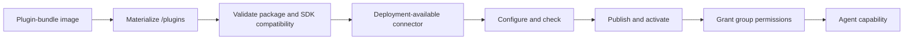

# Connector plugins

Connector plugins add tools, prompts, and resources to Umbod. A plugin is a Python distribution packaged in a plugin-bundle container image.

## Lifecycle

A connector passes through four separate states:

1. **Installed**: the configured plugin image materializes the connector distribution into the Umbod core Pod.
2. **Available**: the connector ID appears in `plugins.availableConnectorIds` in the Helm values.
3. **Configured**: an administrator supplies valid connector settings in Umbod.
4. **Published**: an administrator publishes the connector, activates its capabilities, and grants the required group permissions.

Installing a plugin image does not expose every connector in that image. The Helm availability list is the deployment-level allow-list. Configuration, publication, capability activation, and group permissions remain administrator actions.

## Runtime model

The Helm chart runs the plugin image as an init container. The image copies its bundle into a shared volume, and the matching Umbod core image validates the bundle before the API and MCP containers start. Both services then load the same connector packages read-only.

The core image supplies the Connector SDK. A plugin bundle contains connector code, its runtime dependencies, and Python distribution metadata, but it must not contain another copy of the SDK.

!!! warning
    Connector plugins are trusted Python code. They run inside the Umbod API and MCP processes with the processes' filesystem, network, and environment access. Plugins are not sandboxed or isolated from Umbod or from each other. Review and control every plugin image installed in an environment.

## Current limitations

- One plugin-bundle image can be configured for an Umbod release. Combine all required connector distributions into that bundle.
- Plugins share one Python runtime and dependency namespace with Umbod and each other.
- Connector-builder image, core image, and Helm chart versions must match.
- Plugin images should use immutable tags. Floating tags such as `latest` are unsupported.
- Structural validation does not verify credentials, external service availability, or the safety of connector operations.

Continue with [Build a connector](build-a-connector.md) to package and deploy a connector using the public base image.
