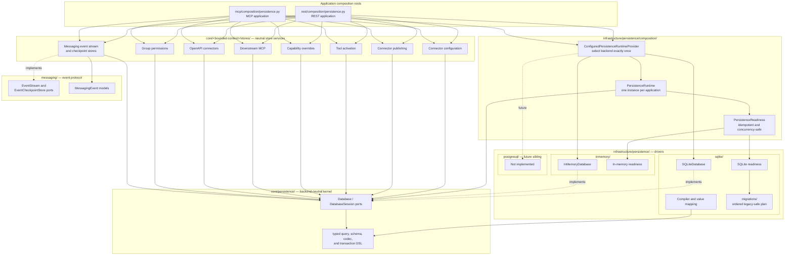

# ADR-001: Backend-Neutral Persistence Module Boundaries

## Status

Accepted

## Context

Umbod must preserve its in-memory and SQLite behavior while making PostgreSQL possible without exposing backend details to domain, REST, or MCP modules.

The current persistence kernel provides neutral database ports and a typed DSL, but composition is incomplete. Some REST and MCP modules still inspect backend configuration, pass SQLite paths, instantiate SQLite adapters, or create persistence resources outside the application-scoped runtime. Migration execution is also distributed across store constructors, and messaging remains a separate path-based persistence stack.

The source tree must make the intended dependency direction visible and mechanically enforceable.

## Decision

Each REST or MCP application creates exactly one application-scoped `PersistenceRuntime` at its composition root. The runtime exposes a backend-neutral `Database` and concurrency-safe `PersistenceReadiness`. All persistent bounded-context services and messaging stores use that runtime database.

Backend selection occurs once in infrastructure composition. Backend-specific drivers, compilers, value mappings, connection behavior, and migrations remain under the corresponding infrastructure driver package. PostgreSQL is a future sibling driver and is not part of this implementation.

Bounded contexts own their neutral store ports, schemas, codecs, and services. They depend on the persistence kernel but never on infrastructure drivers.

### Target module structure

```text
api/src/
├── umbod/
│   ├── core/
│   │   ├── persistence/
│   │   │   ├── ports.py
│   │   │   ├── runtime.py
│   │   │   ├── query.py
│   │   │   ├── schema.py
│   │   │   ├── codecs.py
│   │   │   └── transaction.py
│   │   ├── configuration/persistence/stores/
│   │   ├── publishing/stores/
│   │   ├── capabilities/descriptions/stores/
│   │   ├── activation/stores/
│   │   ├── connectors/
│   │   │   ├── native/
│   │   │   ├── openapi/stores/
│   │   │   └── downstream_mcp/stores/
│   │   ├── permissions/stores/
│   │   └── messaging/
│   │       └── stores/
│   │           ├── schema.py
│   │           ├── event_stream.py
│   │           └── checkpoints.py
│   ├── infrastructure/
│   │   └── persistence/
│   │       ├── composition/
│   │       │   ├── provider.py
│   │       │   └── runtime.py
│   │       ├── inmemory/
│   │       │   ├── database.py
│   │       │   └── readiness.py
│   │       ├── sqlite/
│   │       │   ├── database.py
│   │       │   ├── compiler.py
│   │       │   ├── value_mapping.py
│   │       │   ├── readiness.py
│   │       │   └── migrations/
│   │       │       ├── plan.py
│   │       │       └── versions/
│   │       └── postgresql/
│   │           └── README.md
│   ├── rest/
│   │   └── composition/
│   │       └── persistence.py
│   └── mcp/
│       └── composition/
│           └── persistence.py
└── messaging/
    ├── models.py
    └── ports.py
```

The PostgreSQL directory is an architectural placeholder only. It must not contain a partial driver, compiler, migration implementation, or runtime branch before PostgreSQL work begins.

### Target architecture



Arrows represent allowed compile-time or composition dependencies. Dashed `implements` arrows point from adapters to neutral ports. No dependency may point from the core kernel, a bounded context, or the messaging protocol package into infrastructure.

### Lifecycle and dependency rules

1. REST and MCP each create one `PersistenceRuntime` for their own application lifetime.
2. Lifespan readiness and request-time readiness fallback use the same runtime instance.
3. Backend configuration is consumed only by `ConfiguredPersistenceRuntimeProvider` at the outer composition boundary.
4. Routes, MCP tools, handlers, repositories, and application services receive neutral ports or bounded-context services.
5. Request operation objects remain request-scoped. Only concurrency-safe persistence infrastructure and stateless store services may be application-scoped.
6. Store constructors accept `Database`; they do not accept paths, backend names, or backend configuration.
7. In-memory stores never create an implicit `InMemoryDatabase` in production composition.
8. SQLite stores never create an implicit `SQLiteDatabase` from a path.
9. Schema preparation and legacy migrations run through runtime readiness, not individual store constructors.
10. Backend-specific migrations may use backend-specific APIs and SQL, but remain under that backend's migration package.
11. Messaging uses neutral ports backed by the runtime database while preserving SQLite ordering, `AUTOINCREMENT`, index, checkpoint, transaction, and JSON representation semantics.
12. PostgreSQL will implement the same neutral contracts with an independent compiler and migration plan; it will not branch inside the SQLite implementation.

### Migration ownership

The SQLite readiness plan owns ordered, idempotent preparation for:

- Connector configuration.
- Connector publishing, including the legacy `revision` migration.
- Connector tool activation.
- Capability-description overrides.
- Group permissions.
- OpenAPI normalized catalogs and legacy backfills.
- Downstream MCP definitions, credentials, health, catalogs, and publication state.
- Messaging events and checkpoints after messaging joins the shared runtime.

Neutral schema declarations describe desired structures. They do not replace backend-specific inspection, alteration, backfill, or compatibility migrations.

`SQLitePersistencePlan` is the sole production orchestrator and executes the safe neutral schema phase, connector publishing, OpenAPI, capability overrides, downstream MCP, and messaging exactly once in that order. Migration units receive an existing `SQLiteDatabase`; they neither construct databases from paths nor instantiate operational stores. Migration units may call low-level schema preparation when required for standalone correctness. Adapter-specific tests may invoke an individual migration unit directly.

## Consequences

### Positive

- Folder placement communicates backend-neutral and backend-specific responsibilities.
- PostgreSQL can be added as a sibling adapter without modifying domain stores.
- REST and MCP cannot accidentally select different backends within one application.
- In-memory state remains stable for the application lifetime.
- Migration behavior has one explicit owner.
- Architecture tests can enforce dependency direction and prohibit path-based store construction.

### Negative

- Existing compatibility constructors and path-based factories must be removed or converted.
- Messaging requires careful migration because its SQLite sequence semantics are observable behavior.
- Tests that instantiate concrete stores must explicitly construct and inject a database.
- Existing migration entry points must be consolidated without losing legacy data compatibility.

## Migration sequence

1. Add the missing connector-publication migration to SQLite runtime readiness.
2. Make REST and MCP permission composition consume the runtime database.
3. Move all SQLite migration orchestration into SQLite readiness.
4. Integrate messaging through neutral ports and the runtime-owned database.
5. Remove backend branching and SQLite paths from REST and MCP modules.
6. Remove path-compatible and implicit-database store constructors.
7. Enforce application and request lifetimes through composition tests.
8. Move SQLite-specific identifier rules out of the core DSL.
9. Add architecture tests that enforce the target dependency graph.
10. Add PostgreSQL only after these boundaries are complete.
